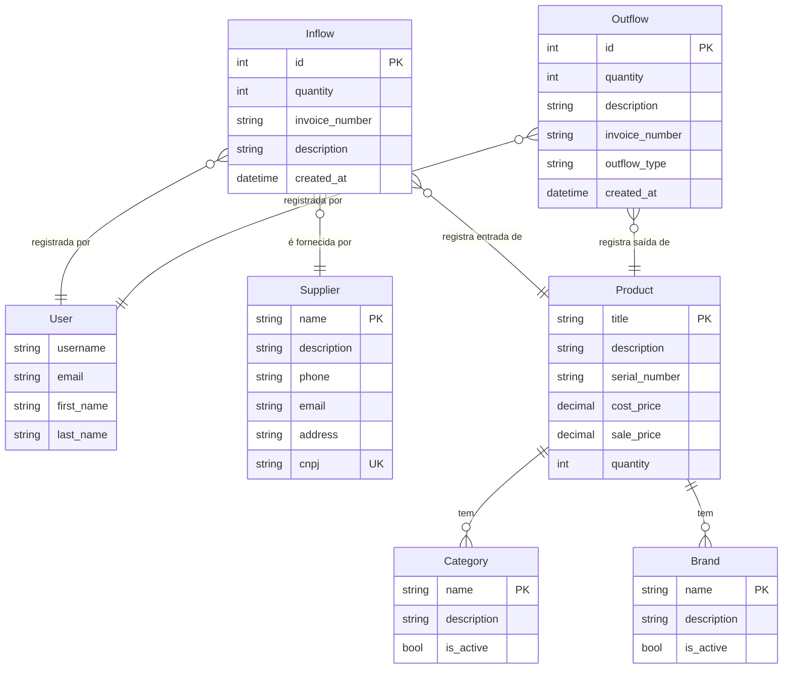

# Sistema de Gerenciamento de Estoque (SGE)

Este é um sistema de gerenciamento de estoque desenvolvido em Django, projetado para controlar produtos, fornecedores, entradas e saídas de estoque.

## Modelo de Entidade e Relacionamento (MER)

A seguir, uma documentação detalhada dos modelos de dados que compõem o sistema.

### Diagrama de Relacionamento

---

### 1. Fornecedor (`Supplier`)

Representa um fornecedor de produtos.

**Arquivo:** `suppliers/models.py`

| Campo | Tipo | Descrição | Opções |
| :--- | :--- | :--- | :--- |
| `name` | `CharField(255)` | Nome do fornecedor. | Obrigatório |
| `description` | `TextField` | Descrição ou observações sobre o fornecedor. | Opcional |
| `phone` | `CharField(20)` | Telefone de contato. | Opcional |
| `email` | `EmailField(255)` | E-mail de contato. | Opcional |
| `address` | `TextField` | Endereço do fornecedor. | Opcional |
| `cnpj` | `CharField(18)` | CNPJ do fornecedor. | Opcional, Único |
| `created_at` | `DateTimeField` | Data de criação do registro. | Automático |
| `updated_at` | `DateTimeField` | Data da última atualização. | Automático |

### 2. Categoria (`Category`)

Representa uma categoria para organizar os produtos.

**Arquivo:** `categories/models.py`

| Campo | Tipo | Descrição | Opções |
| :--- | :--- | :--- | :--- |
| `name` | `CharField(255)` | Nome da categoria. | Obrigatório |
| `description` | `TextField` | Descrição da categoria. | Opcional |
| `is_active` | `BooleanField` | Indica se a categoria está ativa. | Padrão: `True` |
| `created_at` | `DateTimeField` | Data de criação do registro. | Automático |
| `updated_at` | `DateTimeField` | Data da última atualização. | Automático |

### 3. Marca (`Brand`)

Representa a marca de um produto.

**Arquivo:** `brands/models.py`

| Campo | Tipo | Descrição | Opções |
| :--- | :--- | :--- | :--- |
| `name` | `CharField(255)` | Nome da marca. | Obrigatório |
| `description` | `TextField` | Descrição da marca. | Opcional |
| `is_active` | `BooleanField` | Indica se a marca está ativa. | Padrão: `True` |
| `created_at` | `DateTimeField` | Data de criação do registro. | Automático |
| `updated_at` | `DateTimeField` | Data da última atualização. | Automático |

### 4. Produto (`Product`)

Representa um item no estoque. **Observação:** Este modelo foi inferido a partir de suas relações com outros modelos.

**Arquivo:** `products/models.py`

| Campo | Tipo | Descrição | Opções |
| :--- | :--- | :--- | :--- |
| `title` | `CharField` | Nome ou título do produto. | Obrigatório |
| `category` | `ForeignKey(Category)` | A categoria à qual o produto pertence. | `on_delete=models.PROTECT` |
| `brand` | `ForeignKey(Brand)` | A marca do produto. | `on_delete=models.PROTECT` |
| `description` | `TextField` | Descrição detalhada do produto. | Opcional |
| `serial_number` | `CharField` | Número de série ou código único do produto. | Opcional, Único |
| `cost_price` | `DecimalField` | Preço de custo do produto. | Obrigatório |
| `sale_price` | `DecimalField` | Preço de venda do produto. | Obrigatório |
| `quantity` | `IntegerField` | Quantidade atual em estoque. | Padrão: 0 |

### 5. Entrada (`Inflow`)

Registra a entrada de um ou mais itens de um produto no estoque.

**Arquivo:** `inflows/models.py`

| Campo | Tipo | Descrição | Opções |
| :--- | :--- | :--- | :--- |
| `product` | `ForeignKey(Product)` | Produto que está entrando no estoque. | `on_delete=models.CASCADE` |
| `supplier` | `ForeignKey(Supplier)` | Fornecedor do produto. | `on_delete=models.PROTECT` |
| `quantity` | `IntegerField` | Quantidade de itens que entraram. | Obrigatório |
| `invoice_number`| `CharField(50)` | Número da nota fiscal da compra. | Opcional |
| `user` | `ForeignKey(User)` | Usuário que registrou a entrada. | `on_delete=models.SET_NULL` |
| `description` | `TextField` | Descrição ou observações sobre a entrada. | Opcional |
| `created_at` | `DateTimeField` | Data em que a entrada foi registrada. | Automático |
| `updated_at` | `DateTimeField` | Data da última atualização. | Automático |

### 6. Saída (`Outflow`)

Registra a saída de um ou mais itens de um produto do estoque, seja por venda, perda ou ajuste.

**Arquivo:** `outflows/models.py`

| Campo | Tipo | Descrição | Opções |
| :--- | :--- | :--- | :--- |
| `product` | `ForeignKey(Product)` | Produto que está saindo do estoque. | `on_delete=models.PROTECT` |
| `quantity` | `IntegerField` | Quantidade de itens que saíram. | Obrigatório |
| `description` | `TextField` | Descrição ou observações sobre a saída. | Opcional |
| `invoice_number`| `CharField(50)` | Número da nota fiscal da venda (se aplicável). | Opcional |
| `outflow_type` | `CharField(20)` | Tipo de saída: Venda, Perda/Dano, Ajuste. | Padrão: `SALE` |
| `user` | `ForeignKey(User)` | Usuário que registrou a saída. | `on_delete=models.SET_NULL` |
| `created_at` | `DateTimeField` | Data em que a saída foi registrada. | Automático |
| `updated_at` | `DateTimeField` | Data da última atualização. | Automático |